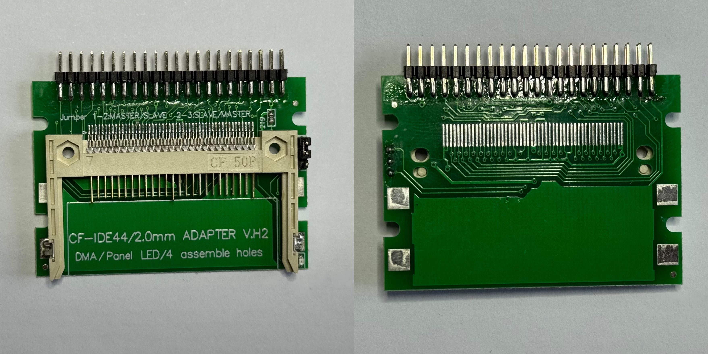
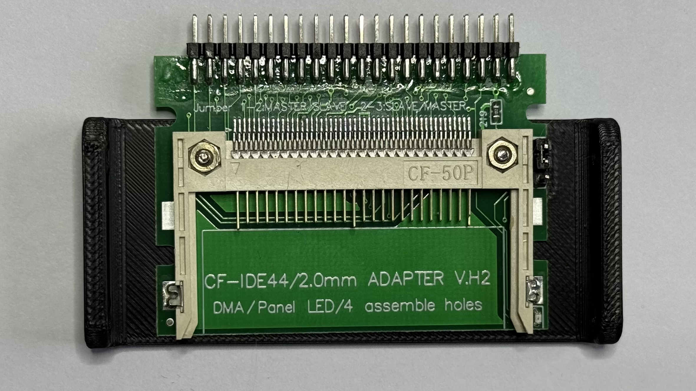
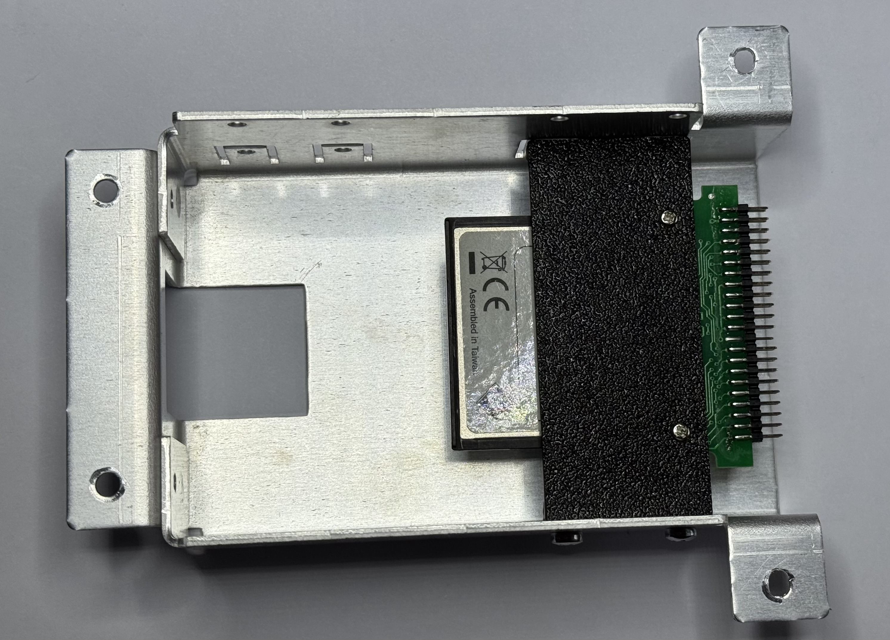

# Tektronix TLA 704 Compact Flash to IDE adapter bracket

This bracket was designed to fit in place of an IDE 2.5 inch HDD inside of a Tektronix TLA 704 logic analyzer. It fits the original mounting holes.

I used ABS for this print with calibrated shrinkage compensation values. I would not recommend using PLA, because the inside of the analyzer gets quite warm after a while.

The adapter used for this mod is one of the most popular generic ones, available on Amazon and AliExpress. It's labeled as "CP-IDE44/2.0mm ADAPTER V.H2".

## Bill of materials

- 4x M3x5 button head screw
- 2x M2x8 button head screw
- 2x M2 nut (DIN 970)
- Generic CF to IDE (44 pin) adapter
- CF card

## Photos

## License
This work is licensed under a [Creative Commons Attribution-NonCommercial-ShareAlike 4.0 International License][https://creativecommons.org/licenses/by-nc-sa/4.0/].
